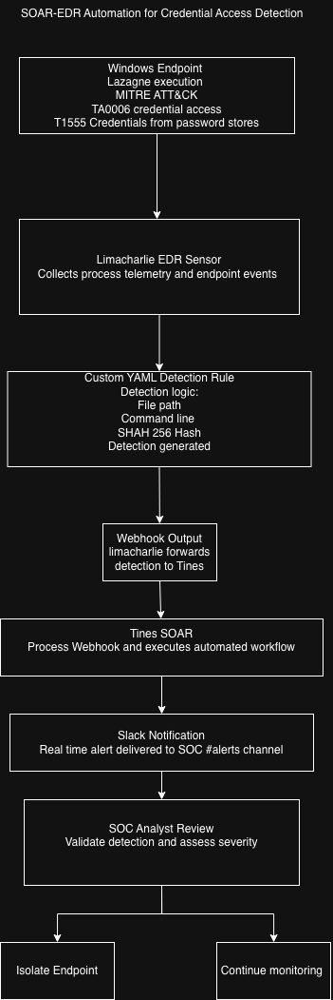
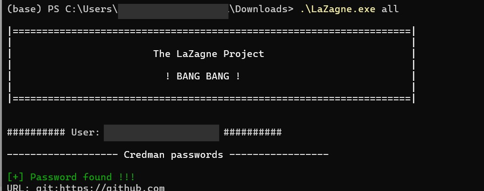
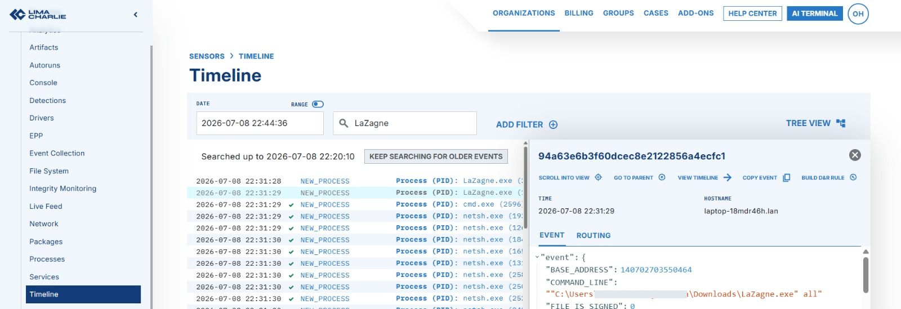
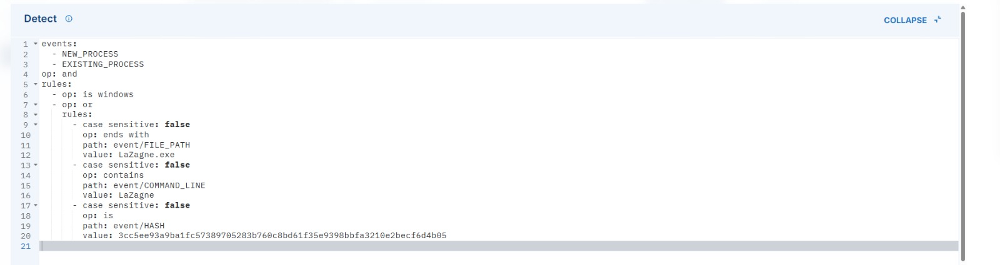
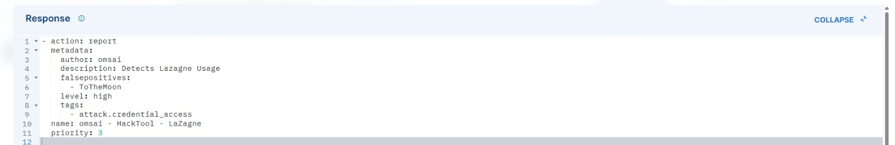
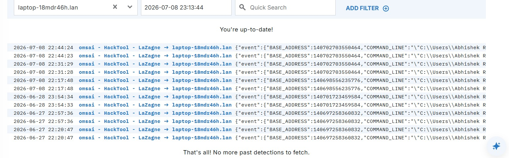
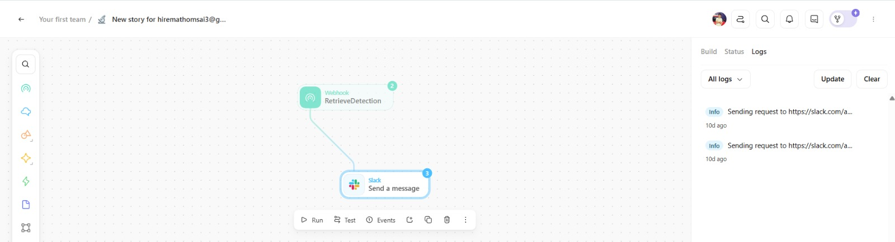
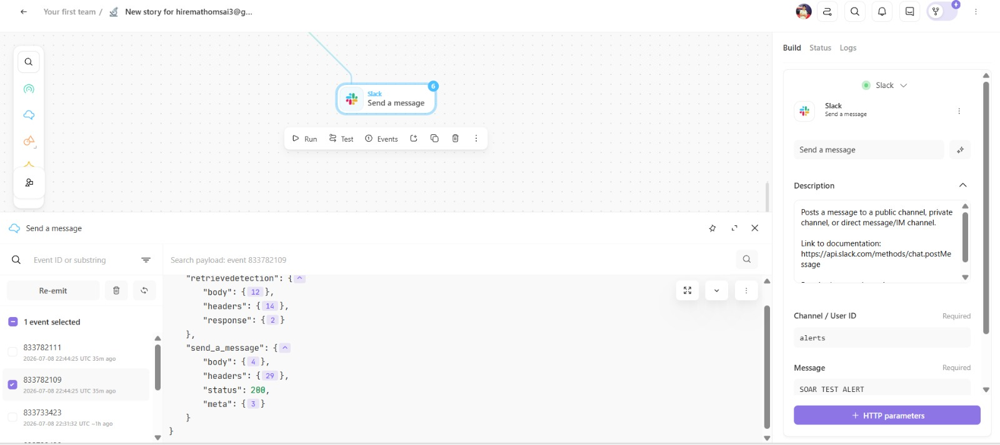
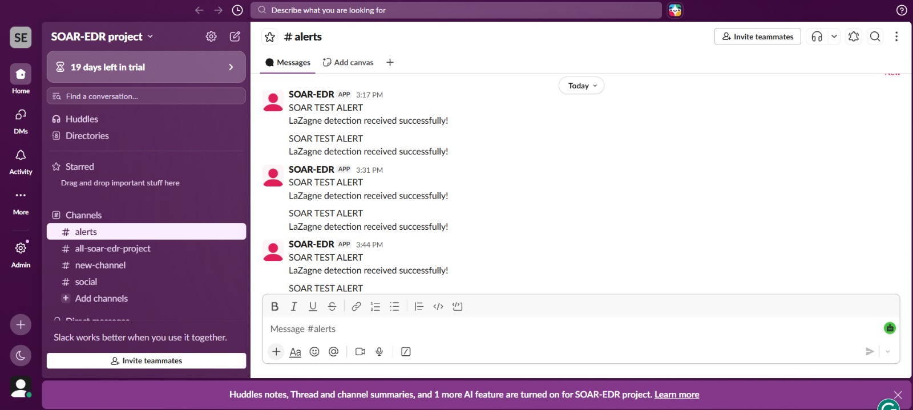

# SOAR-EDR Automation for Credential Access Detection

<p align="center">


</p>

> **End-to-end Security Operations Automation using LimaCharlie EDR, Tines SOAR, and Slack to detect LaZagne credential access activity and automate security alerting.**

---

# Architecture

The following architecture illustrates the complete end-to-end workflow implemented in this project.

<p align="center">

</p>

---

# Project Overview

Modern Security Operations Centers (SOCs) generate thousands of endpoint events every day. Security analysts must rapidly identify suspicious activity, investigate alerts, and determine whether an incident requires immediate action.

This project demonstrates how **Detection Engineering** and **Security Orchestration, Automation, and Response (SOAR)** can be combined to automate the detection and notification process for credential access activity.

A custom **LimaCharlie Detection & Response (D&R)** rule was developed to detect execution of **LaZagne**, an open-source credential recovery tool capable of extracting locally stored credentials from Windows systems. Once detected, LimaCharlie forwards the detection event to **Tines** through a webhook, where an automated workflow processes the event and immediately sends a notification to a dedicated **Slack SOC channel**.

The project simulates a real-world Detection Engineering workflow commonly used by enterprise Security Operations Centers to reduce alert response time and improve analyst efficiency.

---

# Objectives

The primary objectives of this project are:

- Develop a custom endpoint detection rule using LimaCharlie.
- Detect execution of LaZagne using multiple detection techniques.
- Automate event forwarding using Tines webhooks.
- Deliver real-time Slack notifications for SOC analysts.
- Demonstrate an end-to-end Detection Engineering and SOAR workflow.
- Map detection logic to the MITRE ATT&CK framework.

---

# Technologies Used

| Technology | Purpose |
|------------|---------|
| Windows 11 | Endpoint operating system |
| LaZagne | Credential recovery simulation |
| LimaCharlie | Endpoint Detection & Response (EDR) |
| YAML | Custom Detection Rule |
| Tines | Security Orchestration (SOAR) |
| Slack | Analyst Notification Platform |
| PowerShell | Tool execution |
| MITRE ATT&CK | Threat mapping framework |

---

# Workflow

The complete detection pipeline follows the sequence below:

```text
Windows Endpoint
        │
        ▼
LaZagne Execution
        │
        ▼
LimaCharlie EDR Sensor
        │
        ▼
Custom YAML Detection Rule
        │
        ▼
Detection Generated
        │
        ▼
Webhook Output
        │
        ▼
Tines SOAR Workflow
        │
        ▼
Slack Notification
        │
        ▼
SOC Analyst Review
        │
        ▼
Incident Response Decision
```

---

# Repository Structure

```text
SOAR-EDR-Automation
│
├── architecture
│   ├── workflow.drawio
│   └── workflow.png
│
├── docs
│   └── implementation-notes.md
│
├── rules
│   └── lazagne_detection.yaml
│
├── screenshots
│   ├── 01-lazagne-execution.png
│   ├── 02-limacharlie-timeline.png
│   ├── 03-detection-rule-detect.png
│   ├── 04-detection-rule-response.png
│   ├── 05-detections-generated.png
│   ├── 06-tines-workflow.png
│   ├── 07-tines-logs.png
│   └── 08-slack-alert.png
│
├── README.md
├── LICENSE
└── .gitignore
```

---

# Detection Logic

The custom LimaCharlie D&R rule detects LaZagne execution by combining multiple indicators instead of relying on a single signature.

### Detection Conditions

- Windows operating system validation
- File path ending with `LaZagne.exe`
- Command-line containing `LaZagne`
- SHA-256 hash verification (used during testing)

This layered detection approach reduces false positives while maintaining high-confidence alerting for known credential access tools.

---

# MITRE ATT&CK Mapping

| Tactic | Technique | Description |
|---------|-----------|-------------|
| TA0006 | Credential Access | Adversaries attempt to steal account credentials |
| T1555 | Credentials from Password Stores | Retrieval of stored credentials from local systems |

The detection rule is mapped to the MITRE ATT&CK framework to align with industry-standard threat classification practices.

---

# Demonstration

The following screenshots demonstrate the complete end-to-end detection and response workflow.

---

## 1. LaZagne Execution

The attack simulation begins by executing **LaZagne** on the Windows endpoint to enumerate locally stored credentials.

<p align="center">

</p>

---

## 2. LimaCharlie Endpoint Telemetry

LimaCharlie captures the process execution and records endpoint telemetry, including the executed binary, command-line arguments, process metadata, and SHA-256 hash.

<p align="center">

</p>

---

## 3. Detection Rule (Detection Logic)

A custom Detection & Response (D&R) rule evaluates endpoint telemetry using multiple indicators.

Detection criteria include:

- Windows operating system
- File path
- Command-line arguments
- SHA-256 hash verification

<p align="center">

</p>

---

## 4. Detection Rule (Response Logic)

When the detection criteria are satisfied, LimaCharlie generates a high-severity detection event.

<p align="center">

</p>

---

## 5. Detection Generated

After the rule is evaluated successfully, LimaCharlie creates a detection event that can be consumed by downstream automation workflows.

<p align="center">

</p>

---

## 6. Tines SOAR Workflow

The detection is forwarded to Tines through a webhook where the automation workflow processes the event.

<p align="center">

</p>

---

## 7. Workflow Execution

The Tines workflow executes successfully and sends an authenticated request to Slack.

<p align="center">

</p>

---

## 8. Slack Notification

The SOC analyst receives a real-time notification indicating that credential access activity has been detected.

<p align="center">

</p>

---

# Skills Demonstrated

This project demonstrates practical experience in:

- Endpoint Detection & Response (EDR)
- Detection Engineering
- Security Orchestration (SOAR)
- Incident Detection
- YAML Detection Rule Development
- Webhook Integration
- Slack API Integration
- Endpoint Telemetry Analysis
- Windows Security Monitoring
- MITRE ATT&CK Mapping
- Threat Detection Automation
- Security Workflow Design

---

# Key Learning Outcomes

During this project I gained hands-on experience with:

- Building custom endpoint detections
- Understanding endpoint telemetry
- Mapping detections to MITRE ATT&CK
- Integrating EDR with SOAR platforms
- Creating webhook-based automation
- Designing analyst notification workflows
- Troubleshooting endpoint security tooling
- Building practical Detection Engineering workflows

---

# Future Improvements

Potential future enhancements include:

- Automatic endpoint isolation using LimaCharlie Response Actions
- VirusTotal IOC enrichment
- Microsoft Teams integration
- ServiceNow incident creation
- Jira ticket automation
- Email notifications
- Multiple detection rules for additional ATT&CK techniques
- Sigma rule conversion
- IOC reputation lookups
- Automated threat intelligence enrichment

---

# References

- LimaCharlie Documentation
- Tines Documentation
- Slack API Documentation
- MITRE ATT&CK Framework
- LaZagne Project Documentation

---

# Author

**Omsai Suresh Hiremath**

Graduate Student

San Diego State University

Computer Engineering

LinkedIn:
https://linkedin.com/in/omsai-hiremath

---

## ⭐ If you found this project interesting, consider giving the repository a star.